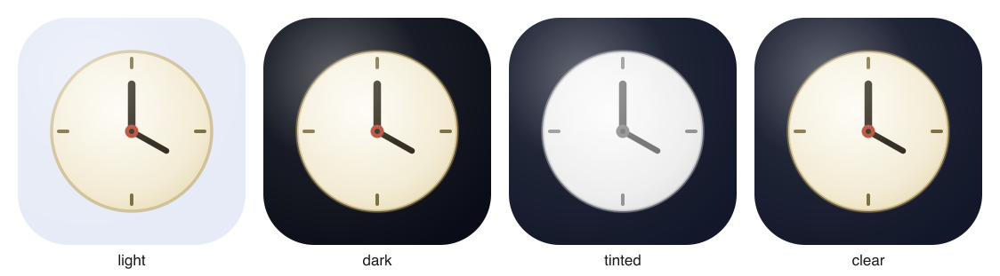

<div align="center">

# 🔨 glassmith

**Forge iOS 26 / macOS 26 _Liquid Glass_ app icons from layered source — assemble, preview every appearance, and wire them straight into Xcode.**

[](LICENSE)
[](https://developer.apple.com/icon-composer/)
[](https://developer.apple.com/xcode/)
[](CONTRIBUTING.md)



</div>

---

Apple's Icon Composer saves a layered **`.icon` bundle** — a directory with an
`icon.json` descriptor and an `Assets/` folder of SVG/PNG layers. The system
composites depth, parallax and the Liquid Glass material from those layers at
runtime. The format is **fully file-based**, so it can be authored, previewed and
installed from the command line, no GUI in the loop.

`glassmith` is that command line. Hand it your layers, get back a valid `.icon`,
review it across **light / dark / tinted / clear**, and drop it into your app.

## Why

- **Reviewable.** Every appearance variant renders to a PNG before anything
  touches your project. You approve, then it integrates.
- **Faithful.** The schema is modelled on the real Icon Composer format and every
  bundle is validated with `actool` (the same compiler Xcode uses).
- **Safe to automate.** Project integration is a dry run by default, backs up
  `project.pbxproj`, and only writes on `--write`.
- **No lock-in.** Plain SVG/PNG layers and a small JSON spec. stdlib Python for
  assembly/preview, `rsvg-convert` for rasterising, `xcodeproj` for the Xcode
  edit. That's it.

## Quickstart

```sh
git clone https://github.com/<owner>/glassmith && cd glassmith
bin/glassmith doctor          # check python3, rsvg-convert, ruby+xcodeproj, actool
bin/glassmith demo            # build the bundled example end-to-end
open examples/demo/out/previews
```

Then for your own icon:

```sh
# 1. write a spec (see schema/spec.md) next to a layers/ folder
bin/glassmith assemble icon.spec.json -o AppIcon.icon

# 2. review every appearance
bin/glassmith preview AppIcon.icon          # -> AppIcon.icon/.previews/*.png

# 3. pre-flight with the real compiler
bin/glassmith validate AppIcon.icon

# 4. wire it into your app (dry run first, then --write)
bin/glassmith integrate --project App.xcodeproj --target App --icon AppIcon.icon
bin/glassmith integrate --project App.xcodeproj --target App --icon AppIcon.icon --write
```

## The spec

A small, ergonomic JSON that maps onto `icon.json`. You provide flat layers; you
do **not** bake in highlights or shadows — the OS does that.

```json
{
  "name": "AppIcon",
  "platforms": "shared",
  "background": "display-p3:0.07,0.09,0.16,1.0",
  "background_specializations": [
    { "appearance": "light", "value": "display-p3:0.90,0.92,0.97,1.0" }
  ],
  "groups": [
    {
      "name": "main",
      "specular": true,
      "shadow": "neutral",
      "layers": [
        { "name": "back", "image": "back.svg" },
        { "name": "fore", "image": "fore.svg" }
      ]
    }
  ]
}
```

Full field reference: [`schema/spec.md`](schema/spec.md) ·
The underlying format: [`schema/icon-json.md`](schema/icon-json.md).

## How it works

```
 layers/ + icon.spec.json
          │  assemble.py
          ▼
   AppIcon.icon  ──► icon.json + Assets/
          │  preview.py (rsvg-convert)
          ▼
   light · dark · tinted · clear  ──►  human review gate
          │  compile.sh (actool)
          ▼
   Assets.car  +  CFBundleIconName     (validation)
          │  integrate.rb (xcodeproj)
          ▼
   your App.xcodeproj
```

## Use it as a Claude Code skill

`skill/liquid-glass-icon/` is an installable [Claude Code](https://claude.com/claude-code)
skill that drives this pipeline end to end, including the review hand-off and the
confirmation gates. Symlink it in:

```sh
ln -s "$PWD/skill/liquid-glass-icon" ~/.claude/skills/liquid-glass-icon
```

## Requirements

| Tool | For | Install |
|---|---|---|
| Python 3.9+ | assemble, preview | preinstalled on macOS |
| `rsvg-convert` | preview rasterisation | `brew install librsvg` |
| Ruby + `xcodeproj` | project integration | ships with CocoaPods, or `gem install xcodeproj` |
| `actool` (Xcode 26+) | validate / compile | Xcode 26+ |

## Limitations

- Previews are **faithful approximations**, not Apple's renderer. They are right
  for composition, colour, depth order and legibility; the exact glass refraction
  only appears on-device. Pixel-exact previews via the simulator are on the
  [roadmap](docs/exact-previews.md) and a great first contribution.
- Layer-level `blend-mode` and `fill` are carried into `icon.json` faithfully but
  only approximated in previews.

## Contributing

Issues and PRs welcome — see [CONTRIBUTING.md](CONTRIBUTING.md). Good first
issues are tagged. The schema notes credit [`rozd/icon-kit`](https://github.com/rozd/icon-kit),
whose reverse-engineering of the `.icon` format informed this project.

## License

MIT © contributors. See [LICENSE](LICENSE).
